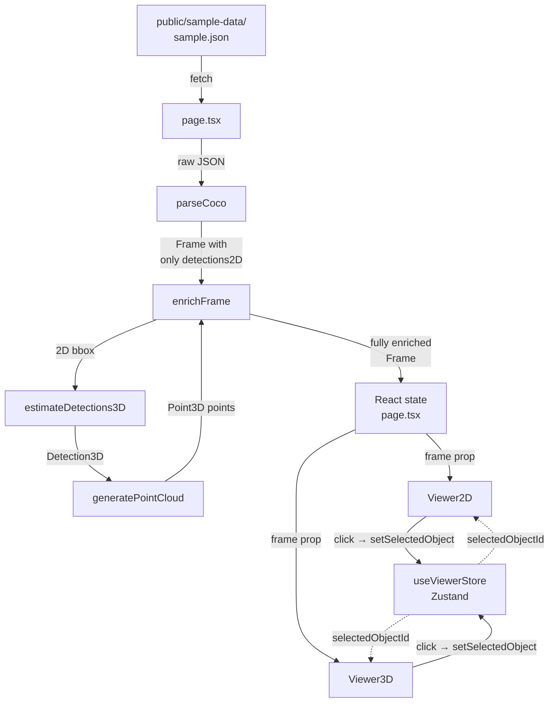
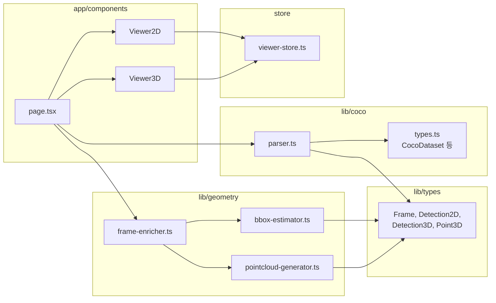
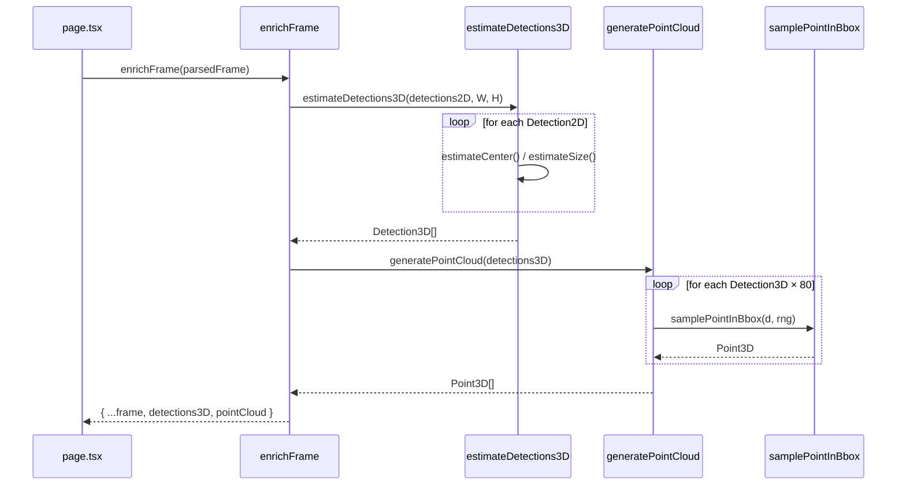

# Step 1~4 기반 코드 학습 노트

> **스냅샷 기준 커밋**: `fd798c4` (2026-05-17)
> **다루는 범위**: COCO 파싱(Step 1), Zustand 스토어(Step 3), 2D→3D 좌표 추정과
> 가짜 포인트 클라우드 생성(Step 4)까지의 모든 `lib/`, `store/` 코드.
> **목적**: 도메인 지식이 거의 없는 상태에서 각 함수가 어떻게 동작하고 서로
> 어떻게 연결되는지 본인이 다시 이 코드를 읽을 때 길잡이가 되는 노트.
> **이 문서의 위치**: 학습 저널. 부패 허용. 정본 위치는 [README](README.md) 참고.

---

## 목차

1. [프로젝트 전체 흐름](#1-프로젝트-전체-흐름)
2. [파일별 역할](#2-파일별-역할)
3. [함수 단위 상세 설명](#3-함수-단위-상세-설명)
4. [데이터 흐름 단계별 추적](#4-데이터-흐름-단계별-추적)
5. [구조 다이어그램 (Mermaid)](#5-구조-다이어그램-mermaid)
6. [초보자용 용어·직관 보강](#6-초보자용-용어직관-보강)
7. [정리와 핵심 개념](#7-정리와-핵심-개념)
8. [설계 문서와의 차이](#8-설계-문서와의-차이)
9. [리팩터링·개선 후보](#9-리팩터링개선-후보)

---

## 1. 프로젝트 전체 흐름

### 한 줄 요약

**COCO JSON(2D 어노테이션) → 내부 `Frame` 타입 → 3D 좌표/포인트 클라우드 추정
→ 페이지 React state → Zustand UI 상태 → 2D/3D 뷰어 동시 렌더링**

### 단계별 흐름

1. **데이터 입력**: 정적 JSON 파일이 `public/sample-data/sample.json`에 있음.
   Next.js 페이지가 `fetch('/sample-data/sample.json')`으로 가져옴.
   (MVP에는 백엔드 없음 — DB/API 없음.)
2. **파싱**: 받은 raw JSON을 [parser.ts](../../apps/ai_detection_viewer_client/src/lib/coco/parser.ts)의
   `parseCoco()`가 내부 `Frame[]`로 변환. 이 시점에는 `detections2D`만 채워져
   있고 `detections3D`와 `pointCloud`는 빈 배열.
3. **3D 보강(enrich)**: [frame-enricher.ts](../../apps/ai_detection_viewer_client/src/lib/geometry/frame-enricher.ts)의
   `enrichFrame()`이 2D bbox를 받아 3D bbox(`detections3D`)와 가짜 포인트 클라우드
   (`pointCloud`)를 채움.
4. **React state 저장**: 페이지 컴포넌트(`app/page.tsx`)가 `Frame[]`을 일반 React
   state에 보관. **프레임 데이터는 Zustand에 넣지 않음** — 의도된 관심사 분리.
5. **Zustand는 UI 상태만**: 어떤 프레임이 선택됐는지, 어떤 객체가 선택됐는지,
   필터값 등만 [viewer-store.ts](../../apps/ai_detection_viewer_client/src/store/viewer-store.ts)에 들어감.
6. **렌더링**: `Viewer2D`와 `Viewer3D`가 같은 enriched `Frame`을 prop으로 받아
   각자 그리고, 클릭 시 store의 `selectedObjectId`를 갱신해 양쪽이 동기화됨.

핵심 설계 의도는 **"파싱/수학 = 순수 함수, React = 렌더링, Zustand = UI 선택
상태"** 세 영역이 절대 섞이지 않는 것. CLAUDE.md Immutable Rule #3("COCO 파싱과
좌표 변환은 React/Zustand 밖에 있어야 한다")이 코드에 그대로 박혀 있음.

---

## 2. 파일별 역할

| 파일 | 책임 | 주요 export | 의존 |
|---|---|---|---|
| [parser.ts](../../apps/ai_detection_viewer_client/src/lib/coco/parser.ts) | COCO raw JSON → `Frame[]` 변환. 검증/방어 로직 포함 | `parseCoco(raw)` | `lib/types`, `./types`(raw 스키마) |
| [bbox-estimator.ts](../../apps/ai_detection_viewer_client/src/lib/geometry/bbox-estimator.ts) | `Detection2D` 한 개 → `Detection3D` 한 개 수학 변환 | `estimateDetection3D`, `estimateDetections3D`, `__testing` | `lib/types`만 |
| [pointcloud-generator.ts](../../apps/ai_detection_viewer_client/src/lib/geometry/pointcloud-generator.ts) | `Detection3D[]` → `Point3D[]` 가짜 포인트 클라우드 | `generatePointCloud`, `makeRng`, `Rng` 타입 | `lib/types`만 |
| [frame-enricher.ts](../../apps/ai_detection_viewer_client/src/lib/geometry/frame-enricher.ts) | 위 두 모듈을 묶어 `Frame`을 enrich (오케스트레이터) | `enrichFrame(frame, options)` | `bbox-estimator`, `pointcloud-generator` |
| [viewer-store.ts](../../apps/ai_detection_viewer_client/src/store/viewer-store.ts) | Zustand로 UI 선택/필터 상태 관리 | `useViewerStore`, `createInitialState`, `ViewerStore` 타입 | `zustand`만 |

**의존 그래프 핵심**: `lib/geometry/`와 `store/`가 **서로를 모름**. React/Zustand는
`lib/`를 import하지만, `lib/`는 React/Zustand를 절대 import하지 않음. 이게 단방향
의존 규칙.

---

## 3. 함수 단위 상세 설명

### 3-1. parser.ts

#### `parseCoco(raw: unknown): Frame[]` ([parser.ts:9](../../apps/ai_detection_viewer_client/src/lib/coco/parser.ts#L9))

- **입력**: 무엇이든 (`unknown`). 외부 파일에서 온 데이터라 신뢰할 수 없음.
- **처리**:
  1. `isCocoDataset()` 타입 가드로 `{ images, annotations, categories }` 형태인지
     확인. 아니면 `console.warn` 후 `[]` 반환 — 빈 데이터가 와도 앱이 죽지 않게
     함 (Error Default 규칙).
  2. `categoryMap` 빌드: `category_id → name` (예: `1 → "person"`). 한 번만
     만들어두면 어노테이션마다 O(1) 조회 가능.
  3. `annotationsByImage` 빌드: 어노테이션을 `image_id`로 그룹핑. 이미지마다
     어노테이션 배열을 다시 훑지 않게 만드는 인덱스.
  4. 이미지를 순회하면서 `buildFrame()`으로 Frame 생성. `seenImageIds`로 중복
     이미지 id를 걸러냄.
- **반환**: `Frame[]` (각 frame은 `detections3D`, `pointCloud`가 `[]`인 상태).
- **왜 이렇게?**: 외부 데이터를 다루는 모든 코드의 정석 — "검증 → 인덱싱 → 빌드"의
  3단계. categoryMap/annotationsByImage를 미리 만들어두지 않으면 N×M 중첩
  루프가 됨.

#### `buildFrame()` ([parser.ts:67](../../apps/ai_detection_viewer_client/src/lib/coco/parser.ts#L67))

- 한 이미지에 대한 Frame 객체 생성.
- 어노테이션을 돌면서 `toDetection2D()` 호출. `null`이 오면 skip(스키마 위반
  어노테이션은 버린다).
- `seenIds` Set으로 같은 frame 안에서의 detection id 중복도 제거.
- **주의점**: `detections3D: []`, `pointCloud: []`로 둠 — 파서는 3D 영역을
  절대 건드리지 않음 (Immutable Rule #3, #7).

#### `toDetection2D()` ([parser.ts:101](../../apps/ai_detection_viewer_client/src/lib/coco/parser.ts#L101))

- **id 생성 규칙**: `` `${imageId}-${ann.id}` `` — 결정론적(deterministic).
  같은 입력 → 항상 같은 id. 이게 **2D/3D 동기화의 핵심**: id가 입력에 의해 100%
  결정돼야 어디서 만들어진 Detection이든 매칭됨.
- **bbox 검증**: 길이 4, 모든 entry가 `Number.isFinite` — `NaN`, `Infinity`,
  문자열 등 거름.
- **confidence fallback**: `score`가 없으면(=ground truth) `1.0`. COCO ground
  truth에는 score가 없는 게 정상이라 falsy fallback이 필요.
- ⚠️ **주의**: bbox의 width/height가 0인 어노테이션은 통과시킴.
  `Number.isFinite(0)`이 true이기 때문. 이게 의도된 동작이고, 0-크기 bbox는
  나중에 `bbox-estimator`에서 `MIN_SIZE_WORLD`로 클램핑됨.

### 3-2. bbox-estimator.ts — 가장 수학적인 파일

이 파일이 전체 프로젝트의 "마법" 부분. 2D 픽셀 좌표를 3D 월드 좌표로 변환하는
수식이 여기 다 있다.

#### 좌표계 차이 (가장 헷갈리는 부분)

| | x | y | 원점 |
|---|---|---|---|
| **이미지(픽셀)** | 오른쪽 + | **아래 +** | 좌상단 |
| **3D 월드(Three.js)** | 오른쪽 + | **위 +** | 화면 중앙 |

→ y축 부호가 반대. 그래서 변환할 때 `y = -cyN * ...`처럼 부호를 뒤집어야 함.
안 뒤집으면 위/아래가 뒤집힌 미러 이미지가 됨.

#### `estimateCenter()` ([bbox-estimator.ts:62](../../apps/ai_detection_viewer_client/src/lib/geometry/bbox-estimator.ts#L62))

bbox 중심점을 3D 월드 좌표 `[x, y, z]`로 변환.

**(1) 픽셀 좌표 → 정규화 좌표 (-1 ~ +1)**:
```ts
const cxN = ((bbox.x + bbox.width / 2) / W) * 2 - 1;
```
- `bbox.x + bbox.width/2` = bbox의 중심 x 픽셀
- `/W` = [0, 1]로 정규화
- `*2 - 1` = [-1, +1]로 재매핑 (좌측 끝 -1, 우측 끝 +1)

**직관적 예시**: 1000px 너비 이미지의 정중앙(x=500) → `(500/1000)*2 - 1 = 0`.
좌측 끝 → -1, 우측 끝 → +1. ✅

**(2) 정규화 좌표 → 월드 좌표**:
```ts
const x = cxN * SCENE_HALF_Y * aspect;  // SCENE_HALF_Y=5
const y = -cyN * SCENE_HALF_Y;
```
- `SCENE_HALF_Y = 5` → 3D 씬은 y축 기준 ±5 범위 안에 들어감.
- `aspect = W/H` → 와이드 이미지는 x축이 더 길게 펼쳐짐 (이미지 종횡비 보존).
- `-cyN` → y축 뒤집기.

**(3) z (깊이) 추정 — 핵심 트릭**:
```ts
const areaRatio = (bbox.width * bbox.height) / (W * H);
const z = MAX_Z - areaRatio * (MAX_Z - MIN_Z);  // MIN_Z=1, MAX_Z=8
```
- **원리**: "원근법(perspective)" — 가까운 물체는 크게, 먼 물체는 작게 보인다.
  그래서 **bbox 면적이 클수록 카메라에 가깝다고 가정**.
- bbox가 이미지 전체를 채울 때(`areaRatio=1`) → `z = MIN_Z = 1` (가장 가까움).
- bbox가 거의 점일 때(`areaRatio≈0`) → `z = MAX_Z = 8` (가장 멈).
- ⚠️ **이건 추정값** — COCO는 실제 깊이 데이터가 없음 (Immutable Rule #6, #7).
  진짜 깊이가 아니라 시각화 트릭.

#### `estimateSize()` ([bbox-estimator.ts:80](../../apps/ai_detection_viewer_client/src/lib/geometry/bbox-estimator.ts#L80))

3D bbox의 크기(폭/높이/깊이) 계산.
- `sx`, `sy`: bbox 픽셀 크기를 월드 크기로 비례 변환.
- `sz = (sx + sy) / 2`: **3D 데이터가 없으니 깊이 두께는 가짜로 만들어야 함**.
  폭/높이의 평균으로 대충 정육면체 비슷하게.
- `Math.max(..., MIN_SIZE_WORLD)`: bbox width/height가 0이어도 wireframe이
  보이도록 최소 0.05 보장. 0-크기 박스는 wireframe이 점으로 찍혀 안 보이기 때문.
- ⚠️ **중요**: center와 z는 클램핑하지 않음 — 0-크기여도 위치 자체는 원본
  데이터를 보존해야 정확. 오직 렌더링용 size만 클램핑.

#### `estimateDetection3D()` / `estimateDetections3D()` ([bbox-estimator.ts:38](../../apps/ai_detection_viewer_client/src/lib/geometry/bbox-estimator.ts#L38))

- 단일 / 배열 버전.
- **id, class, confidence는 그대로 전달**. 이게 Immutable Rule #1
  (`Detection2D.id === Detection3D.id`)을 강제하는 지점.

### 3-3. pointcloud-generator.ts

#### `generatePointCloud()` ([pointcloud-generator.ts:18](../../apps/ai_detection_viewer_client/src/lib/geometry/pointcloud-generator.ts#L18))

- 각 3D bbox 안에 `pointsPerDetection`(기본 80)개의 점을 랜덤 분포.
- 이게 "가짜 포인트 클라우드"의 정체 — 실제 LiDAR 스캔이 아니라, "각 객체가
  차지하는 부피 안에 점을 뿌려서 시각적으로 포인트 클라우드처럼 보이게" 하는 트릭.
- 빈 입력이나 `pointsPerDetection<=0`이면 `[]` 반환 — 가드.

#### `samplePointInBbox()` ([pointcloud-generator.ts:34](../../apps/ai_detection_viewer_client/src/lib/geometry/pointcloud-generator.ts#L34))

```ts
x: cx + (rng() - 0.5) * sx
```
- `rng()` 범위는 `[0, 1)`이므로 `(rng() - 0.5)` 범위는 `[-0.5, 0.5)`.
- 곱하면 `[-sx/2, +sx/2)` 범위가 되고, center `cx`에 더하면 → `cx - sx/2` ~
  `cx + sx/2` 즉 bbox 내부 균등 분포.
- `intensity: d.confidence` → 점의 "강도"를 confidence로 저장. 추후 색상
  인코딩에 활용 가능.

#### `makeRng(seed)` ([pointcloud-generator.ts:49](../../apps/ai_detection_viewer_client/src/lib/geometry/pointcloud-generator.ts#L49))

- **mulberry32**라는 잘 알려진 시드 가능한 PRNG (pseudo-random number generator).
- 왜 필요? `Math.random`은 시드를 못 줘서 호출할 때마다 결과가 다름 → 테스트에서
  "같은 입력 → 같은 출력" 검증이 불가능.
- 같은 seed → 항상 같은 시퀀스. 테스트에서 재현 가능한 랜덤성을 만들 때 표준적인
  트릭.

**왜 mulberry32?** 짧고(코드 6줄), 통계적 품질 적당하고, 외부 의존성 없음.
암호학적 용도가 아닌 시각화 샘플링에는 충분.

### 3-4. frame-enricher.ts

#### `enrichFrame()` ([frame-enricher.ts:12](../../apps/ai_detection_viewer_client/src/lib/geometry/frame-enricher.ts#L12))

- **역할**: 두 추정 모듈을 묶는 얇은 오케스트레이터.
- **입력**: 파서가 만든 Frame (detections3D, pointCloud가 `[]`인 상태).
- **처리**:
  1. `estimateDetections3D()` 호출 → detections3D 채움.
  2. `generatePointCloud()` 호출 → pointCloud 채움.
  3. spread로 새 Frame 객체 반환 (불변성 유지).
- **`options` 파라미터**: 테스트 가능성을 위한 hook. 프로덕션에서는 기본값
  (Math.random, 80개) 사용, 테스트에서는 seeded rng로 결정론적 출력 만듦.
- **순서 의존성**: pointCloud는 detections3D 안에 점을 뿌리므로 반드시 3D bbox가
  먼저 만들어져야 함.

### 3-5. viewer-store.ts

#### `createInitialState()` ([viewer-store.ts:22](../../apps/ai_detection_viewer_client/src/store/viewer-store.ts#L22))

- 상수가 아니라 **함수(factory)**. 호출할 때마다 새 `Set` 인스턴스 생성.
- **왜 factory?**: `visibleClasses: new Set()` 같은 객체를 모듈 최상위에 두면
  모든 store 인스턴스가 같은 Set 참조를 공유함. 한 곳에서 `add()` 하면 다른
  곳도 변함 — 테스트 격리 깨짐. (Edge_#3 Case 2에서 발견된 이슈)

#### `useViewerStore` ([viewer-store.ts:31](../../apps/ai_detection_viewer_client/src/store/viewer-store.ts#L31))

Zustand의 `create()`로 만든 훅. Zustand가 처음이라면 짚고 가면:
- `create((set) => ({...}))` 패턴.
- `set`은 React `setState`와 비슷하지만 **객체를 부분 병합**해줌
  (`set({ a: 1 })` 하면 다른 필드는 보존).
- 컴포넌트에서 `useViewerStore(state => state.selectedObjectId)`처럼 셀렉터로
  구독.
- 셀렉터 값이 변할 때만 리렌더링 — Context API의 "모든 구독자 리렌더" 문제 없음.

#### `setConfidenceThreshold` ([viewer-store.ts:35](../../apps/ai_detection_viewer_client/src/store/viewer-store.ts#L35))

- `Number.isFinite(v)` 가드 → `NaN`/`±Infinity` 거부.
- **왜?**: 슬라이더 등에서 잘못된 값이 들어오면 `confidence >= NaN`은 항상
  `false` → 모든 detection이 사라지는 silent bug. 이게 Step 7 필터 셀렉터를
  망가뜨림.
- 거부 + warn + **이전 값 유지**. Throw하지 않음 → UI가 죽지 않음.
- `clamp01(v)` → 슬라이더가 0~1 밖 값을 보내도 안전.

#### `toggleClass` ([viewer-store.ts:47](../../apps/ai_detection_viewer_client/src/store/viewer-store.ts#L47))

- `new Set(state.visibleClasses)` — **새 Set 인스턴스를 만드는 게 핵심**.
- Zustand는 참조 비교(`===`)로 변경을 감지. 기존 Set에 `add/delete`만 하면
  참조가 같아서 컴포넌트가 리렌더 안 됨.
- React의 "state는 immutable처럼 다루라"는 원칙과 동일.

---

## 4. 데이터 흐름 단계별 추적

구체적 예시: "frame_001.jpg, 사람 한 명 bbox" 한 건이 어떻게 흐르는가.

| 단계 | 데이터 형태 | 누가 | 비고 |
|---|---|---|---|
| 1. JSON 파일 | `{ images: [{id:1, file_name:"frame_001.jpg", width:640, height:480}], annotations: [{id:10, image_id:1, category_id:1, bbox:[100, 50, 80, 200]}], categories: [{id:1, name:"person"}] }` | 정적 파일 | — |
| 2. fetch | `unknown` (raw JSON) | `app/page.tsx` (추정) | — |
| 3. `parseCoco(raw)` | `Frame[]` 중 한 Frame: `{ id:"1", imageUrl:"/sample-data/frame_001.jpg", imageWidth:640, imageHeight:480, detections2D:[{id:"1-10", class:"person", confidence:1.0, bbox:{x:100, y:50, width:80, height:200}}], detections3D:[], pointCloud:[] }` | `parser.ts` | id가 `"1-10"`으로 결정론적 생성 |
| 4. `enrichFrame(frame)` | 같은 Frame인데 detections3D, pointCloud가 채워짐 | `frame-enricher.ts` | 아래 5,6 단계 합친 것 |
| 5. `estimateDetections3D` | `[{id:"1-10", class:"person", confidence:1.0, bbox3D:{center:[?,?,?], size:[?,?,?]}}]` | `bbox-estimator.ts` | id 보존 |
| 6. `generatePointCloud` | `[{x,y,z,intensity:1.0}, ... 80개]` | `pointcloud-generator.ts` | bbox 내부 균등 분포 |
| 7. React state | `frames: Frame[]` 페이지 컴포넌트 상태 | `app/page.tsx` | Zustand 아님 |
| 8. props 전달 | `<Viewer2D frame={frames[0]} />`, `<Viewer3D frame={frames[0]} />` | page | 같은 frame 객체 공유 |
| 9. 사용자 클릭 | (Step 5에서) bbox 클릭 → `onSelect("1-10")` 콜백 | viewer 컴포넌트 | 현재는 placeholder |
| 10. store 업데이트 | `useViewerStore.setSelectedObject("1-10")` → `selectedObjectId = "1-10"` | Zustand | Step 5에서 wire 예정 |
| 11. 양쪽 리렌더 | Viewer2D, Viewer3D가 `selectedObjectId` 구독 → 동시에 강조 | React | 동기화 완성 |

### 구체적 숫자 예시

640×480 이미지, bbox=(100, 50, 80, 200) 한 건이 `estimateCenter`를 통과할 때:

```
aspect    = 640/480 = 1.333
cxN       = ((100 + 40) / 640) * 2 - 1 = 0.21875 * 2 - 1 = -0.5625
cyN       = ((50 + 100) / 480) * 2 - 1 = 0.3125  * 2 - 1 = -0.375
x         = -0.5625 * 5 * 1.333         = -3.75    // 화면 왼쪽
y         = -(-0.375) * 5               =  1.875   // 화면 위쪽 (y 뒤집힘)
areaRatio = (80*200) / (640*480)        =  0.0521
z         = 8 - 0.0521 * (8-1)          =  7.635   // 비교적 멀리
```

→ center `[-3.75, 1.875, 7.635]`. 좌상단이라 x가 음수, y가 양수, 작은 bbox라
z가 큼(멀음). ✅ 직관과 일치.

---

## 5. 구조 다이어그램 (Mermaid)

### 5-1. 전체 데이터 흐름



### 5-2. 파일 의존 관계



핵심: `lib/`는 `store/`, `components/` 어디로도 화살표가 가지 않음.

### 5-3. enrichFrame 호출 흐름



---

## 6. 초보자용 용어·직관 보강

| 용어 | 한 줄 정의 |
|---|---|
| **BufferGeometry** | Three.js에서 점/선/면 데이터를 GPU에 효율적으로 올리는 자료구조. 일반 JS 배열보다 메모리도 적게 쓰고 GPU 전송도 빠름. 수만 개 점도 부드럽게 그릴 수 있는 이유. |
| **EdgesGeometry** | 도형의 모서리만 추출한 geometry. 3D bbox를 "와이어프레임 박스"로 그릴 때 사용. |
| **OrbitControls** | 마우스로 카메라를 회전/줌하게 해주는 헬퍼. drei가 한 줄로 제공. |
| **PRNG** | "Pseudo-Random Number Generator". 진짜 랜덤이 아니라 수학 공식으로 만든 수열인데, 시드를 주면 항상 같은 시퀀스 → 테스트 가능. |
| **타입 가드** (`isCocoDataset`) | 런타임에서 값의 형태를 확인하면서 동시에 TypeScript에게 타입을 알려주는 함수. `: raw is CocoDataset` 부분이 그 표식. |
| **셀렉터(selector)** | Zustand/Redux에서 store의 일부만 골라 꺼내는 함수. 셀렉터 값이 변할 때만 리렌더가 발생. |
| **raycaster** | 마우스 클릭이 3D 공간의 어떤 오브젝트에 닿았는지를 감지하는 기술. Step 5에서 사용 예정. |

### z축 직관 다시

카메라가 `(0, 0, -10)`에 있고 `+z` 방향을 봄. 그래서 z가 작으면 카메라에
가깝고, z가 크면 멈. bbox가 클수록 가까이 있다고 가정하니 z가 작아짐. `(0,0,4.5)`
타겟은 씬의 중심을 살짝 안쪽에 두기 위함 (객체들이 대략 z=1~8 사이에 있으니
그 중간쯤).

---

## 7. 정리와 핵심 개념

### 전체 구조 요약

- **3-layer 단방향 아키텍처**: `lib/`(순수 함수) ← `store/`(UI 상태) ←
  `components/`(렌더링).
- **데이터 흐름**: JSON → parse → enrich → React state → Zustand → 양뷰 동기화.
- **파싱(2D)과 추정(3D)이 분리**: 입력 형식이 KITTI 등으로 바뀌어도
  `lib/geometry/`는 그대로 재사용 가능.

### 핵심 함수

| 함수 | 위치 | 역할 |
|---|---|---|
| `parseCoco` | parser.ts:9 | COCO JSON 검증 + 변환 |
| `estimateDetection3D` | bbox-estimator.ts:38 | 2D→3D 좌표 추정 (단일) |
| `estimateCenter` / `estimateSize` | bbox-estimator.ts:62/80 | 수학 변환의 코어 |
| `generatePointCloud` | pointcloud-generator.ts:18 | 가짜 포인트 클라우드 생성 |
| `enrichFrame` | frame-enricher.ts:12 | 두 추정 모듈의 오케스트레이터 |
| `useViewerStore` | viewer-store.ts:31 | Zustand 전역 UI 상태 |

### 가장 중요한 데이터 타입

- **`Frame`**: 한 이미지에 대한 모든 것 (image, 2D detections, 3D detections,
  point cloud).
- **`Detection2D` / `Detection3D`**: id를 공유 — 멀티뷰 동기화의 토대.
- **`ViewerStore`**: 선택/필터 단일 진실 공급원.

### 꼭 이해해야 할 핵심 개념

1. **id 결정론**: `${imageId}-${ann.id}`. 같은 입력 → 같은 id. 이게 깨지면
   2D↔3D 동기화가 깨짐.
2. **추정 vs 실제**: 3D 좌표는 모두 2D bbox에서 만든 시각화 트릭. 실제 깊이
   데이터 아님.
3. **단방향 의존**: `lib/`는 React/Zustand를 모름. 이걸 깨면 단위 테스트도 깨지고
   입력 데이터셋 교체도 어려워짐.
4. **불변성**: `toggleClass`에서 새 Set, `enrichFrame`에서 spread — 참조 비교로
   변경을 감지하는 React/Zustand의 작동 방식 때문.
5. **방어 코딩의 일관성**: 잘못된 입력은 throw가 아니라 warn + skip/fallback.
   앱이 죽지 않게.

---

## 8. 설계 문서와의 차이

- `PROJECT_DESIGN.md` §11의 타입과 `architecture.md`/실제 코드의 타입은 거의
  일치. `Frame`에 `imageWidth`/`imageHeight`가 Step 2에서 추가됐는데
  PROJECT_DESIGN.md에도 반영돼 있음 (라인 280-281). 일관됨.
- **차이점 하나**: PROJECT_DESIGN.md §5는 Recharts를 기술 스택에 포함하지만,
  CLAUDE.md는 "post-MVP까지 금지". 두 문서가 시점이 다른 셈인데 CLAUDE.md가 더
  엄격하고 그게 정본으로 보임.

---

## 9. 리팩터링·개선 후보

> 지금 당장 손대지는 않을 후보들. 학습용으로 "왜 이런 개선 여지가 있는가"를
> 인지하기 위함.

1. **`page.tsx`에서 매번 enrichFrame 호출**: 프레임이 많아지면 무거워질 수 있음.
   `useMemo`로 캐싱하거나 worker로 옮기는 게 가능. 현재 10프레임 수준에선 불필요.
2. **상수 외부화**: `SCENE_HALF_Y`, `MIN_Z`, `MAX_Z`,
   `DEFAULT_POINTS_PER_DETECTION`이 각 파일에 박힌 매직 넘버.
   `lib/geometry/constants.ts`로 모으면 튜닝/문서화 한곳에서 가능. 단, 지금 한
   파일에서만 쓰니 YAGNI 원칙상 그대로도 OK.
3. **에러 핸들링의 통일**: 일부는 `console.warn` + skip, 일부는 fallback. 좀
   더 큰 프로젝트면 `Result<T, E>` 패턴이나 수집된 에러 객체를 UI까지 보내는
   구조가 좋음. MVP엔 과함.
4. **`pointCloud`가 enrich 시점에 잠김** (Edge_#4 Case 5 문서화됨): Step 7
   필터를 적용하면 detections는 줄어드는데 pointCloud는 그대로. Step 7 진입 시
   filtered detections 기반으로 재생성 필요. 이미 알려진 todo.
5. **카메라 상태 프레임 간 보존** (Edge_#4 Case 6): 프레임 바꾸면 카메라가
   리셋되는 문제. Step 8 처리 예정.
6. **`area→z` 매핑이 선형**: 실제 원근법은 비선형(역제곱에 가까움). 시각화용으로
   선형도 충분하지만 더 사실적이려면
   `z = MIN_Z + (1-sqrt(areaRatio))*(MAX_Z-MIN_Z)` 같은 식이 가능. 포트폴리오
   어필 포인트로 한 줄 추가할 수 있음.
7. **`estimateSize`의 `sz=(sx+sy)/2`**: 깊이 두께를 평균으로 잡는 건 자의적.
   class 별로 다른 비율을 주면 (car는 더 길게, person은 더 얇게) 시각적으로 더
   그럴듯해짐. 단, "AI 데이터 도메인 관점에서 추정값"이라는 정직성을 유지해야
   함 (Immutable Rule #6).

---

## Step 5 진입 전 체크

다음 Step(2D ↔ 3D 선택 동기화)을 시작하기 전에 이 노트에서 이미 다룬 것:
- `Detection2D.id === Detection3D.id` 불변 조건 → bbox-estimator가 그대로
  전달함을 확인.
- `useViewerStore.setSelectedObject` 액션 시그니처 → Viewer2D/Viewer3D의
  `onSelect` placeholder와 호환.

Step 5 노트에서 새로 다뤄야 할 것:
- raycaster의 동작 원리.
- "빈 공간 클릭 = deselect" 패턴이 SVG vs 3D에서 각각 어떻게 구현되는가.
- 통합 테스트가 처음 등장 — 데이터 계약만 검증하는 통합 테스트가 어떤 모양인가.
